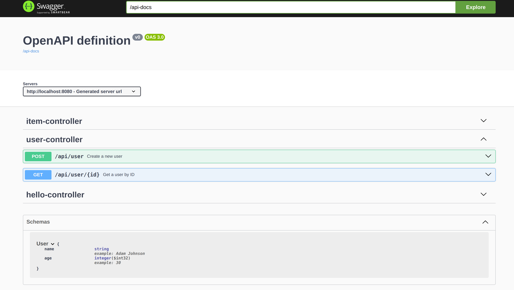

# Spring Boot Application with Dummy Controllers and Swagger Integration

![Spring Boot][1] ![Swagger][2] ![Documentation][3]

[1]: https://img.shields.io/:Java-SpringBoot-Green.svg?style=round-square
[2]: https://img.shields.io/:Doc-Swagger-teal.svg?style=round-square
[3]: https://img.shields.io/:Documentation-yellow.svg?style=round-square

This is a simple Spring Boot application that demonstrates how to integrate Swagger for API documentation using OpenAPI.

## Description

The project consists of the following components:
- Dummy controllers: These are RESTful controllers with basic CRUD operations for managing dummy data.
- Swagger integration: Swagger is integrated using `springdoc-openapi-ui` to generate API documentation.

## Requirements

- Java 11 or higher
- Maven
  

## API Documentation

The API documentation is generated using Swagger and can be accessed through the Swagger UI at http://localhost:8080/swagger-ui.html. It provides details about the available endpoints, request/response schemas, and example values.

## Example Endpoints

- POST /api/user: Create a new user with dummy data.
- GET /api/user/{id}: Retrieve a user by ID.

## License

This project is licensed under the MIT License.
